# Titanic-Survival-Analysis

---

## 📝 Introduction

The Titanic dataset is a historical dataset containing details of passengers aboard the RMS Titanic, which sank in April 1912. This analysis explores how passenger demographics, travel details, and socio-economic factors influenced survival chances.

---

## 🎯 Problem Statement
By analyzing the Titanic passenger dataset, we aim to identify the main factors that contributed to survival rates, focusing on class, gender, fare, and family size.

---

## 🛠 Skills Demonstrated
- **Data Cleaning** (handling missing values, formatting)
- **Exploratory Data Analysis (EDA)** with Pandas
- **Data Visualization** with Matplotlib & Seaborn
- **Statistical Analysis** (percentages, group comparisons)
- **Python Scripting & Documentation**

---

## 📂 Data Sourcing
Dataset sourced from the **Seaborn** library's built-in datasets:  
```python
import seaborn as sns
df = sns.load_dataset('titanic')
```
## 📋 Data Description

| Column        | Description |
|---------------|-------------|
| survived      | 0 = Did not survive, 1 = Survived |
| pclass        | Ticket class (1 = First, 2 = Second, 3 = Third) |
| sex           | Gender of the passenger |
| age           | Age of passenger in years |
| sibsp         | Number of siblings/spouses aboard |
| parch         | Number of parents/children aboard |
| fare          | Ticket fare (£) |
| embarked      | Port of embarkation (C = Cherbourg, Q = Queenstown, S = Southampton) |
| class         | Passenger class (First, Second, Third) |
| who           | Passenger type (man, woman, child) |
| adult_male    | Boolean indicating if passenger is an adult male |
| deck          | Deck letter where passenger stayed (if known) |
| embark_town   | Name of embarkation town |
| alive         | Survival status (‘yes’/’no’) |
| alone         | Boolean indicating if passenger traveled alone |

---

## ❓ Questions & Analysis

### 1️⃣ What is the survival rate of passengers?
```python
# survival rate of passengers

survival_rate = df['survived'].mean()
print(f"Survival rate: {survival_rate:.2%}")
```
**Result:** **38.38%** of passengers survived.  

---

### 2️⃣ What is the gender distribution of passengers?
```python
gender_distribution = df['sex'].value_counts()
print("\n2. Gender distribution:\n", gender_distribution)
```
| Gender | Count |
|--------|-------|
| Male   | 577 |
| Female | 314 |

```python
# To visualize the output
plt.figure(figsize=(12, 6))
df['sex'].value_counts().plot(kind='bar', title="Gender Distribution")
plt.ylabel("Count")
plt.show()
```

📷 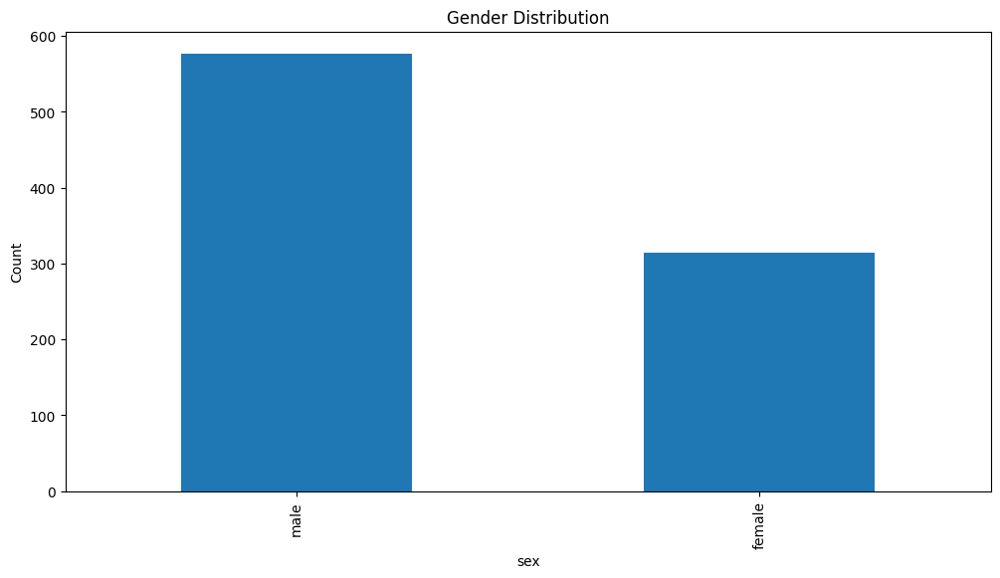

---

### 3️⃣ How does survival rate differ by class?
```python
survival_by_class = df.groupby('pclass')['survived'].mean()
print("\n3. Survival rate by class:\n", survival_by_class)
```
| Class | Survival Rate |
|-------|---------------|
| 1     | 0.6296 |
| 2     | 0.4728 |
| 3     | 0.2424 |

```python
plt.figure(figsize=(12, 6))
sns.barplot(data=df, x='pclass', y='survived')
plt.title("Survival Rate by Passenger Class")
plt.ylabel("Survival Rate")
plt.show()
```

📷 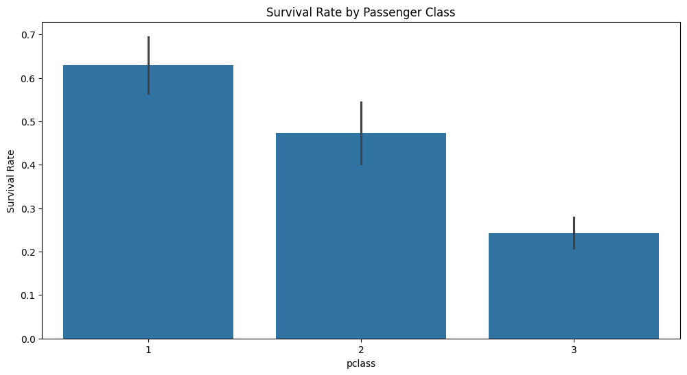

---

### 4️⃣ What is the distribution of passenger ages?
```python
plt.figure(figsize=(12, 6))
sns.histplot(df['age'].dropna(), kde=True, bins=40)
plt.title("Distribution of Passenger Ages")
plt.xlabel("Age")
plt.show()
```
📷 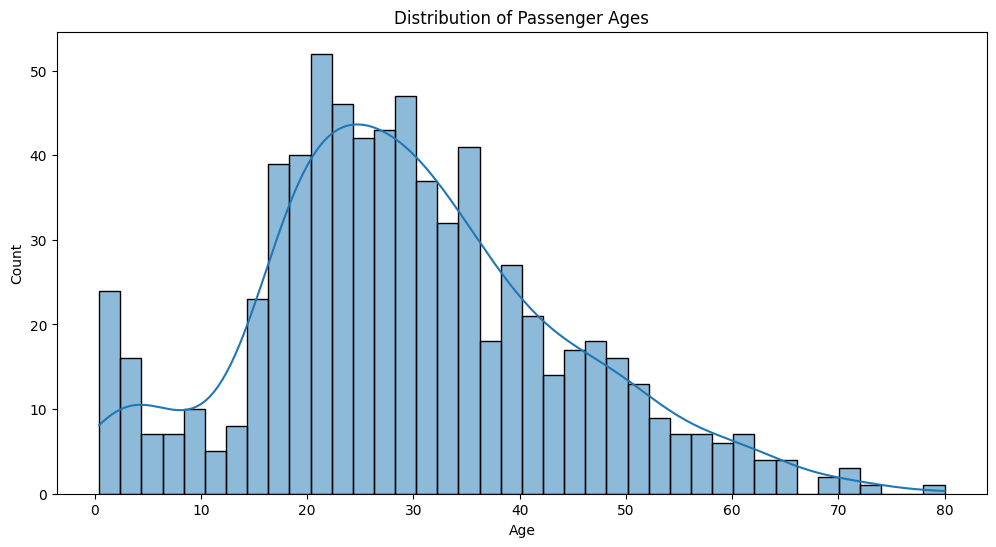

---

### 5️⃣ How many passengers embarked from each location?
```python
embarked_counts = df['embarked'].value_counts()
print("\n5. Embarkation counts:\n", embarked_counts)
```
| Embark Town | Passenger Count |
|-------------|-----------------|
| Southampton | 644 |
| Cherbourg   | 168 |
| Queenstown  | 77 |

```python
# To visualize the output
plt.figure(figsize=(12, 6))

df['embarked'].value_counts().plot(kind='bar', title="Embarkation Count")
plt.ylabel("Passengers")
plt.show()
```

📷 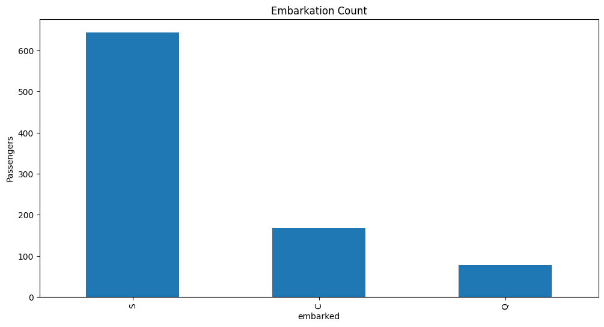

---

### 6️⃣ What is the average fare paid per class?
```python
avg_fare_per_class = df.groupby('pclass')['fare'].mean()
print("\n6. Average fare per class:\n", avg_fare_per_class)
```
| Class | Average Fare (£) |
|-------|------------------|
| 1     | 84.15 |
| 2     | 20.66 |
| 3     | 13.68 |
```python
# To visualize the output
plt.figure(figsize=(12, 6))
df.groupby('pclass')['fare'].mean().plot(kind='bar', title="Average Fare by Class")
plt.ylabel("Average Fare")
plt.show()
```

📷 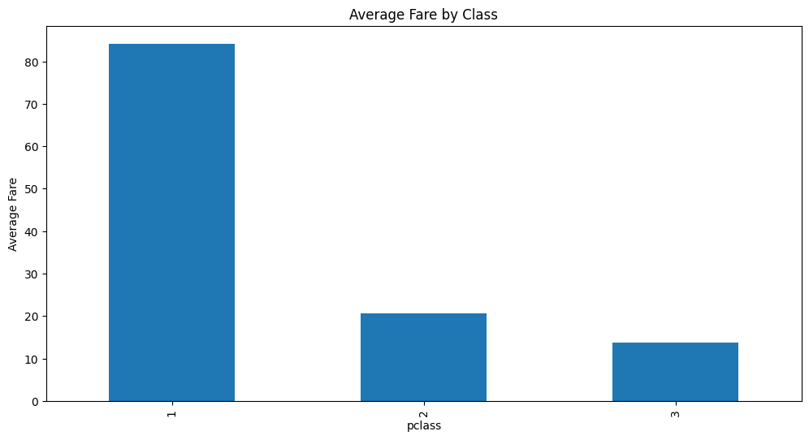

---

### 7️⃣ How does gender affect survival rates?
```python
survival_by_gender = df.groupby('sex')['survived'].mean()
print("\n7. Survival rate by gender:\n", survival_by_gender)
```
| Gender | Survival Rate |
|--------|---------------|
| Female | 74.20% |
| Male   | 18.89% |

```python
#To visualize the output
plt.figure(figsize=(12, 6))
sns.barplot(data=df, x='sex', y='survived')
plt.title("Survival Rate by Gender")
plt.ylabel("Survival Rate")
plt.show()
```

📷 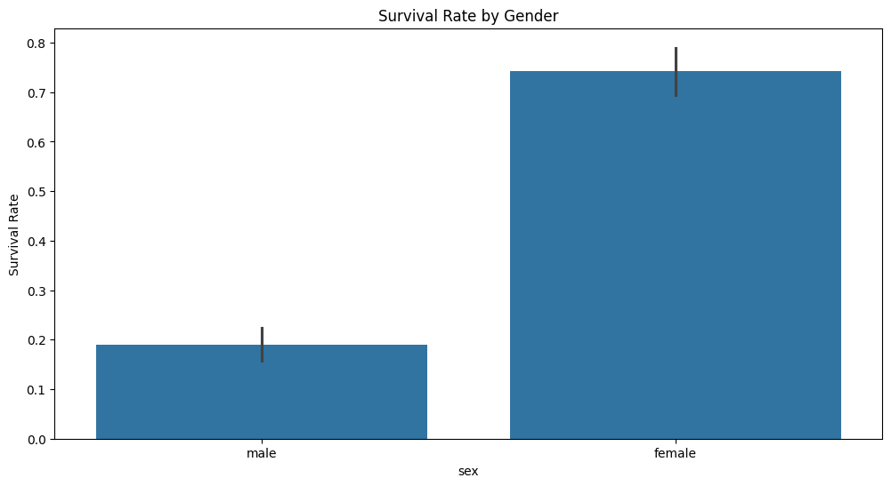

---

```python
df['Group'] = df['sex'].str.capitalize() + ' - Class ' + df['class'].astype(str)

# Calculate survival rate per group
survival_stats = df.groupby('Group')['survived'].mean().sort_values()

# Plotting
plt.figure(figsize=(12, 6))
survival_stats.plot(kind='bar', color='seagreen', edgecolor='black')

plt.axhline(0.5, color='gray', linestyle='--', linewidth=1)
plt.title('Titanic Survival Rate by Gender and Passenger Class', fontsize=14)
plt.ylabel('Survival Rate')
plt.ylim(0, 1)
plt.xticks(rotation=45, ha='right')
plt.tight_layout()

plt.show()
```
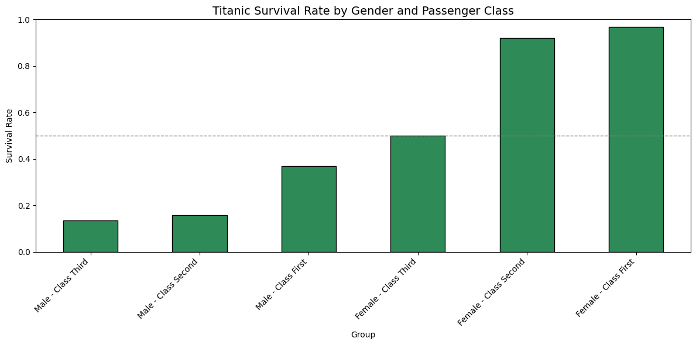
---

### 8️⃣ What is the correlation between fare and survival?
```python
fare_survival_corr = df['fare'].corr(df['survived'])
print("\n8. Correlation between fare and survival:", round(fare_survival_corr, 3))
```
**output:** Correlation between fare and survival: 0.257

```python
#To visualize the output
plt.figure(figsize=(12, 6))

sns.scatterplot(data=df, x='fare', y='survived')
plt.title("Fare vs. Survival")
plt.show()

correlation = df[['fare', 'survived']].corr().iloc[0,1]
print(f"Correlation between fare and survival: {correlation:.2f}")
```
📷 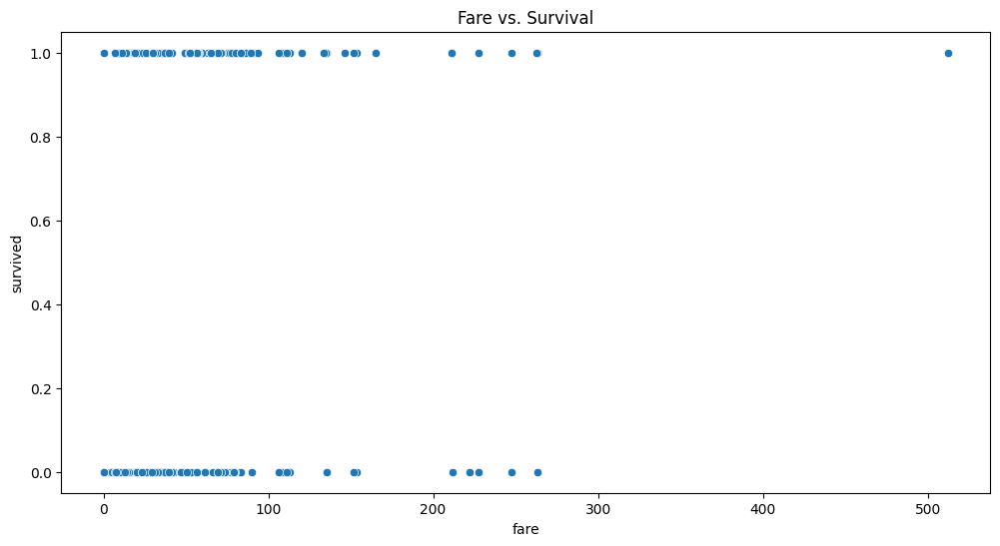

---

### 9️⃣ How does the number of siblings/spouses aboard affect survival?
```python
survival_by_sibsp = df.groupby('sibsp')['survived'].mean()
print("\n9. Survival rate by number of siblings/spouses aboard:\n", survival_by_sibsp)
```
| Siblings/Spouses (SibSp) | Survival Rate |
|--------------------------|---------------|
| 0 | 34.54% |
| 1 | 53.59% |
| 2 | 46.43% |
| 3 | 25.00% |
| 4 | 16.67% |
| 5 | 0.00% |
| 8 | 0.00% |

```python
plt.figure(figsize=(12, 6))
sns.barplot(data=df, x='sibsp', y='survived')
plt.title("Survival Rate by Siblings/Spouses Aboard")
plt.ylabel("Survival Rate")
plt.show()
```

📷 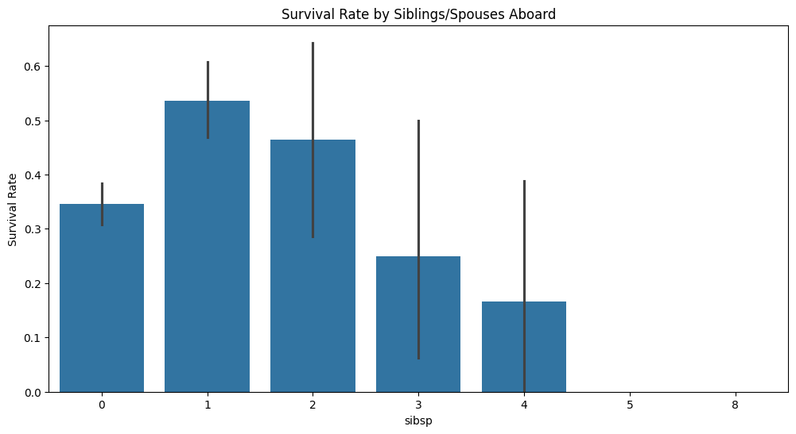

---

### 🔟 What is the age distribution by class?
```python
age_by_class = df.groupby('pclass')['age'].describe()
print("\n10. Age distribution by class:\n", age_by_class)
plt.figure(figsize=(12, 6))
sns.boxplot(data=df, x='pclass', y='age')
plt.title("Age Distribution by Class")
plt.show()
```
📷 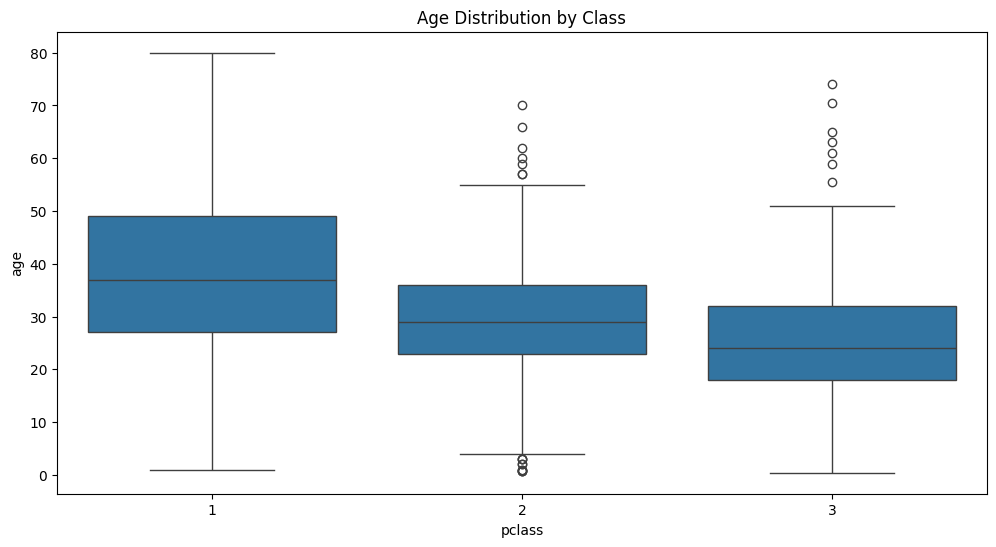

---

### 1️⃣1️⃣ What is the survival rate by embarkation point?
```python
survival_by_embark = df.groupby('embarked')['survived'].mean()
print("\n11. Survival rate by embarkation point:\n", survival_by_embark)
```
| Embark Town | Survival Rate |
|-------------|---------------|
| Cherbourg   | 0.553571 |
| Queenstown  | 0.389610 |
| Southampton | 0.336957 |
```python
# To visualize the output
plt.figure(figsize=(12, 6))
sns.barplot(data=df, x='embarked', y='survived')
plt.title("Survival Rate by Embarkation Point")
plt.ylabel("Survival Rate")
plt.show()
```

📷 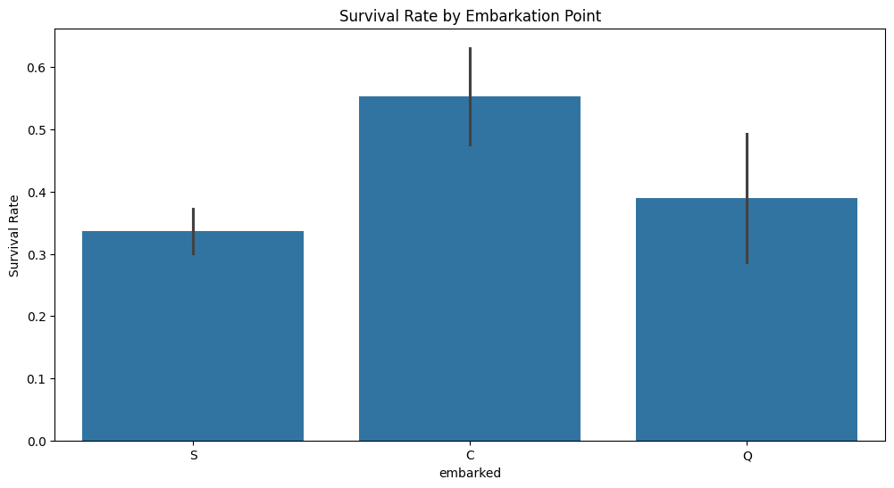

---

### 1️⃣2️⃣ What is the impact of having parents/children aboard on survival?
```python
survival_by_parch = df.groupby('parch')['survived'].mean()
print("\n12. Survival rate by number of parents/children aboard:\n", survival_by_parch)
```
| Parents/Children (Parch) | Survival Rate |
|--------------------------|---------------|
| 0 | 0.343658 |
| 1 | 0.550847 |
| 2 | 0.500000 |
| 3 | 0.600000 |
| 4 | 0.000000 |
| 5 | 0.200000 |
| 6 | 0.000000 |

```python
# To visualize the output
plt.figure(figsize=(12, 6))
sns.barplot(data=df, x='parch', y='survived')
plt.title("Survival Rate by Parents/Children Aboard")
plt.ylabel("Survival Rate")
plt.show()
```

📷 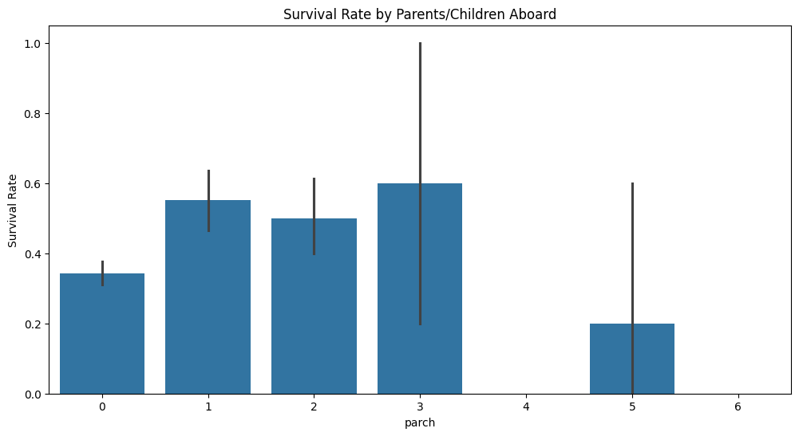

---

## 📈 Interpretation of Results
- **Socio-economic status mattered** — First-class passengers had the highest survival rates.
- **Gender played a big role** — Women were more likely to survive than men.
- **Fare correlated positively** with survival — Higher-paying passengers had better chances.
- **Small family groups (1–2)** increased survival rates, while large families had lower chances.
- **Cherbourg passengers** had higher survival rates than other embarkation points.

---

## 💡 Recommendations
1. Implement **equal evacuation procedures** regardless of passenger class.
2. Maintain **priority for women and children**, but ensure fair access for others.
3. **Spread lifeboat access points** evenly to reach all cabins quickly.
4. **Train staff** for crowd management in large family groups.
5. Consider **safety drills** during the voyage to increase survival chances.

---

## 🏁 Conclusion

The Titanic dataset shows survival was heavily influenced by **class**, **gender**, **fare paid**, **family size**, and **embarkation location**.  
These findings serve as lessons for improving **maritime safety policies**, ensuring fair access to evacuation resources, and reducing bias in survival outcomes during emergencies.

---


